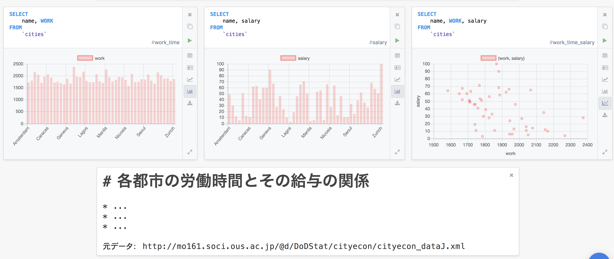
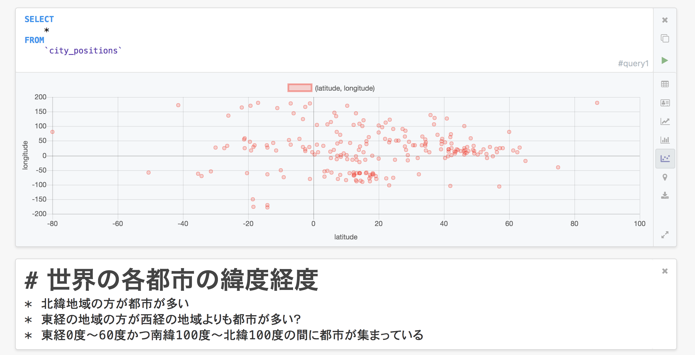

# Franchiseのススメ

---

# Franchiseとは...

## 多機能なSQLのクライアント

- SQLの実行結果をビジュアライズできる
- 結果や記述をノートブックとして記録できる
- 多様な形式にエクスポートできる
- ノートをHTMLとして保存できる

---

# SQLの実行結果をビジュアライズできる
棒グラフ、散布図、地図など様々な形式にボタン一つで視覚化することができます。

---

# ノートブックとして記録できる
実験ノートのようにSQLの実行結果を受けて議論や思ったことを記録していくことができます。

---

# データを多様な形式にエクスポートできる

- CSV / TSV
- XLSX（Excel2013の形式）
- HTML
- JSON

---

# ノートをHTMLとして保存できる

---

# Franchiseに残る大きな課題

## PostgresにSSL接続ができない
つまり、現在はLAに接続することができないです。
リブセンスで利用するには致命的な問題を抱えています。😢

---

# しかし、この課題には希望がある

ひと月前にGithubのissueに挙がっており、
中の人が「今すぐではないが、対応をする。」と言っています。
- https://github.com/HVF/franchise/issues/21

---